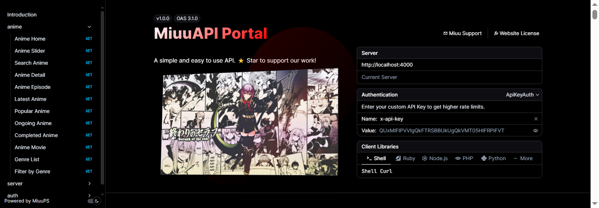

# MiuuAPI Infrastructure

MiuuAPI is a state-of-the-art API gateway and documentation infrastructure engineered for high-availability web services. Built on a modular Hono architecture with native Node.js clustering, it delivers exceptional performance, real-time monitoring, and a premium developer experience.

---

## System Preview

### Main Interface


---

## Core Capabilities

### High Availability Clustering
Native implementation of the Node.js Cluster module allows for seamless multi-core process management. This ensures maximum CPU utilization, automatic worker recovery, and zero-downtime service availability under high traffic loads.

### Premium Documentation Engine
A highly customized Scalar integration featuring a glassmorphism design system. Includes a theme-aware preloader and hardware-accelerated transitions that automatically adapt to system-level light and dark mode preferences.

### Security and Rate Management
Robust security layer providing mandatory header validation, CORS policy enforcement, and a tiered rate-limiting system. Supports high-throughput access via secure API Key authentication.

---

## Technical Specifications

| Component | Technology | Role |
| :--- | :--- | :--- |
| Core Framework | Hono | Ultra-fast routing and middleware execution |
| Runtime Environment | Node.js | Asynchronous event-driven execution |
| API Specification | OpenAPI 3.1.0 | Standardized documentation and schema definition |
| Data Validation | Zod | Runtime type-safety and request validation |
| Interface Styling | Vanilla CSS | Custom-built design tokens and animations |

---

## Deployment Guide

### Prerequisites
* Node.js v20.0.0 or higher
* npm v10.0.0 or higher

### Installation
```bash
git clone https://github.com/miuubyte/API.git
cd API
npm install
```

### Execution Profiles

**Standard Execution**
```bash
npm run start
```

**Cluster Performance Mode**
```bash
npm run dev:cluster
```

---

## API Reference

### Anime and Media Services
Endpoints for comprehensive media metadata retrieval.

| Endpoint | Method | Parameter | Description |
| :--- | :--- | :--- | :--- |
| `/api/anime/home` | GET | None | Global featured content and latest updates. |
| `/api/anime/search` | GET | `q` | Full-text search across the media database. |
| `/api/anime/detail/{slug}` | GET | `slug` | Comprehensive metadata for a single entry. |
| `/api/anime/episode/{slug}` | GET | `slug` | Direct streaming assets and mirror availability. |
| `/api/anime/popular` | GET | None | High-engagement titles based on user traffic. |

### Infrastructure Monitoring
System-level diagnostics and real-time health metrics.

| Endpoint | Method | Description |
| :--- | :--- | :--- |
| `/api/stats` | GET | Detailed hardware metrics (CPU, RAM, Uptime, Network). |
| `/api/auth/check` | GET | Authentication token validation and tier status. |

---

## Integration Example

### Standard API Request
```bash
curl -X GET "http://localhost:4000/api/anime/search?q=query" \
     -H "x-api-key: your_api_token" \
     -H "Content-Type: application/json"
```

### Standard JSON Response
```json
{
  "success": true,
  "status": 200,
  "data": {
    "title": "Example Media",
    "slug": "example-media",
    "status": "Ongoing",
    "episodes": 12
  }
}
```

---
Developed by MiuuPS